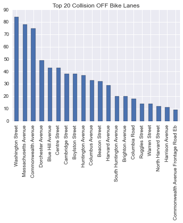

# BU CASCS 591 L1 Data Mechanics Spring 2016

# Project #2

**Enze Yan**
**enze@bu.edu**

### Background

> Since former Mayor Menino launched Boston Bikes **(http://www.bostonbikes.org/)** in 2007, ridership in the City has more than doubled. Many other important strides have been made in safety, education, and facilities.

> Boston Bikes is putting together a broad picture of cycling in Boston by analyzing data from a variety of sources. The Boston Public Health Commission is analyzing crash data from Boston Emergency Medical Services, Boston Police Department and local emergency departments. Further, Boston Bikes confirmed ridership using information compiled by the League of American Bicyclists. Boston Bikes conducted multiple surveys with over 4,000 respondents. Key findings can soon be found here once fully analyzed. Boston Bikes will continue to seek public input in the upcoming year to improve bike safety, education, and ridership.

> Additionally, Boston Bikes conducted its annual traffic counts at 24 different locations. Together, these sources of data provide a broad picture of cycling in Boston. Boston Bikes will continue seek public input in the upcoming year to improve bike safety, education, and ridership.

### Datasets

**The Bicycle Collisions in Boston Database**

Draws off of Boston Police Department records to document those bike collisions that occurred in Boston from 2009 – 2012. The database was constructed as part of a research-policy collaboration between Dahianna Lopez (Harvard School of Public Health) and the Boston Police Department.

The database contains a single spreadsheet (Bicycle Collisions.xlsx) and an accompanying shape file that enables mapping and spatial analysis (Bicycle Collisions.shp and associated files.

The Bicycle Collision database contains all bicycle collisions in the city of Boston during 2009 – 2012 that were recorded in Boston Police Department records. The database itself is derived predominantly from these records. The database contains 1,815 collisions.

**Boston Existing Bike Lane Database**

The Boston Bike Network provides a vision for developing bike lanes and paths throughout the City.

**Boston,MA Metro Extracts**

City-sized portions of OpenStreetMap, served weekly

### Problem to Solve:

Use the existing bicycle collisions data, we could compare the incidents frequeny between the roads with bike lane or and roads without bike lane. It turns out that the incidents are less likely to happen in a bike lanes, which was suggested by the plots, even though there are more incidents happening on the road with a bike lane. That could suggest that everyone is eager to use the bike lane.

Format: 

Format: 

I am trying to figure out what are the improvement on a bike lane? What are the bike lanes that we could add to the street to make biking safer? I am planning on using a SMT solver to tackle this problem. I have already generate a special database - intersection_lane.csv, which contains all the roads that have had at least one collision happend on this street. It also collects the data which tells if there is a bike lane on this given road. The last step is to put this model into an SMT solver.

### Reference

- http://hubhacks-vermonster.s3-website-us-west-2.amazonaws.com/
- https://data.cityofboston.gov/
- http://www.cityofboston.gov/bikes/statistics.asp
- http://www.mass.gov/anf/research-and-tech/it-serv-and-support/application-serv/office-of-geographic-information-massgis/datalayers/bicycle-trails.html
- http://bostonopendata.boston.opendata.arcgis.com/datasets?q=bike
- http://maps.cityofboston.gov/ArcGIS/rest/services/BaseServices/Bike_network/MapServer
- https://dataverse.harvard.edu/dataset.xhtml?persistentId=doi:10.7910/DVN/24713
- http://www.cityofboston.gov/bikes/BikeNetwork/

